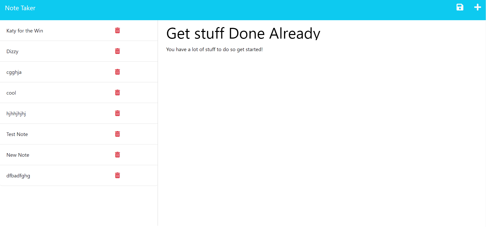
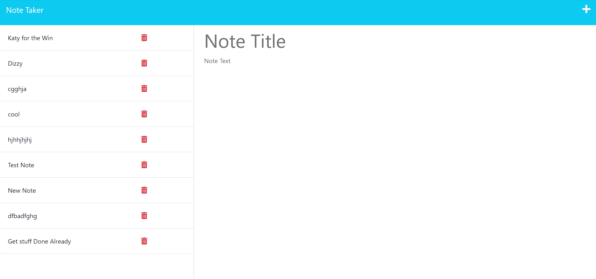

# Note Taker App Two

## Project Summary

The goal of this assignment was to create an application called Note Taker where the user is able to write and save multiple notes to keep their tasks organized. With the application's front end already having been created, we were to modify the starter code using Express.js in the back end that is able to save and retrieve data in the notes from the JSON File. Then connect the front end and back end of the application and deploy the entire application to Heroku.

## How The Application Works:
The user is first taken to the Note Taker "Get Started" page. When the "Get Started" button is clicked they are taken to the Note Taker page. They can now give their note a title and enter the text of their note. When text has been entered into both fields a small icon appears in the upper right side of the page. When clicked it saves their notes to the the left side of the page, where they can click on previous notes to see what text is in each note.

### Here is the link to the Note Taker App Two deployed in Heroku.

[Click here to see my Note Taker App Two deployed in Heroku.](https://note-taker-app-two.herokuapp.com/)

